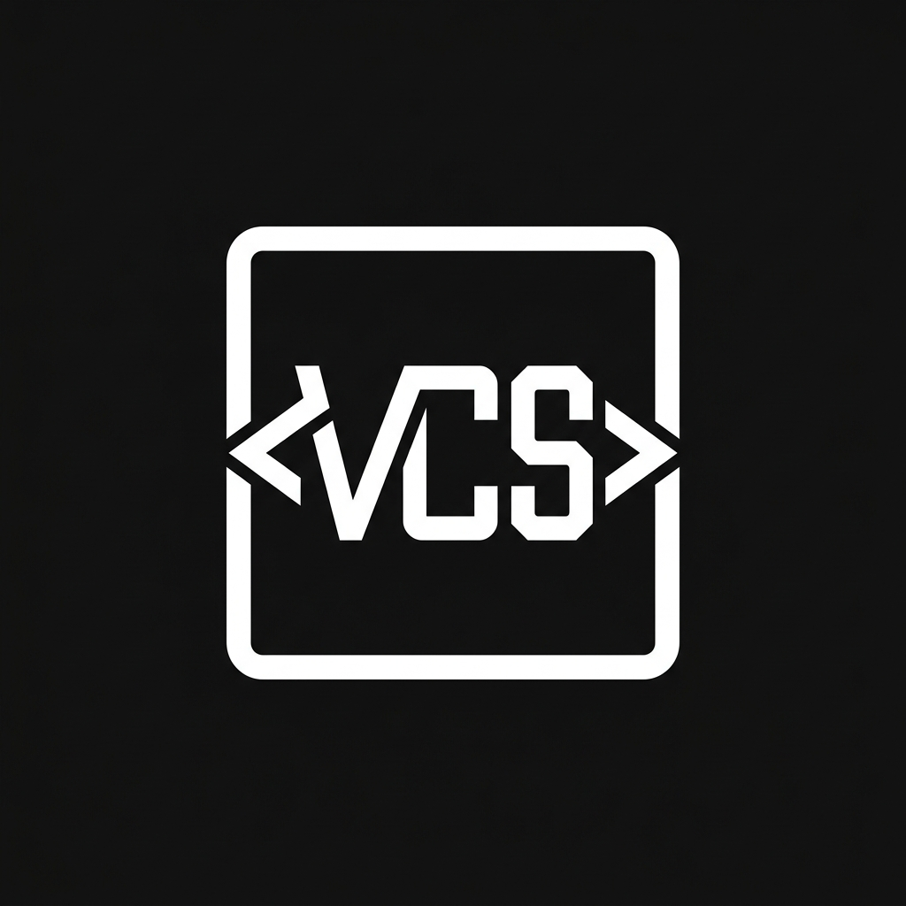
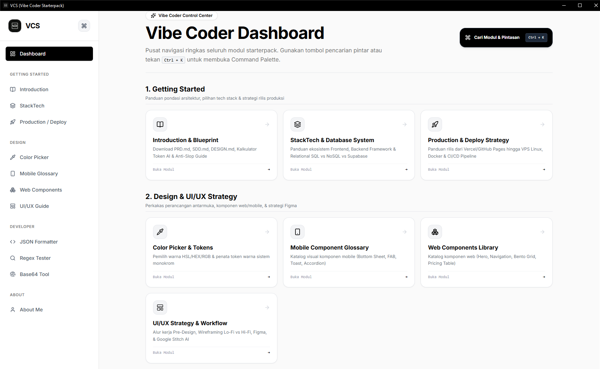
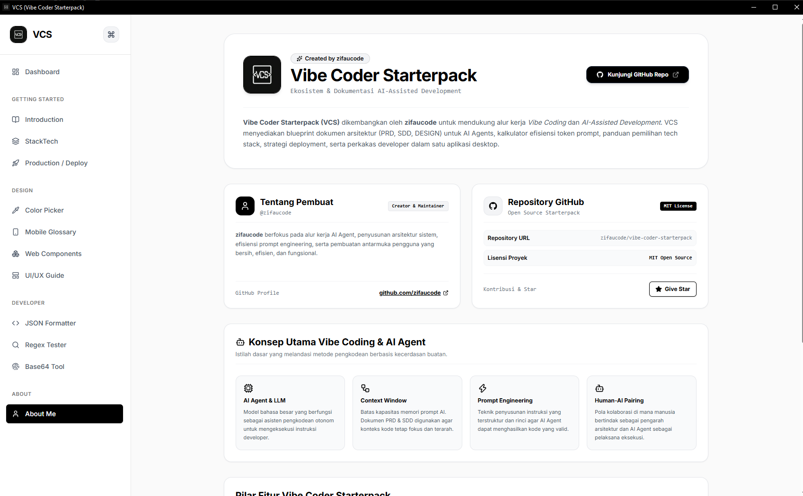

<div align="center">
  

  <h1>Vibe Coder Starterpack (VCS)</h1>

  <p>
    <b>Dokumentasi Arsitektur, Tech Stack Guide, & Developer Utilities</b><br>
    <i>Aplikasi Desktop Native untuk Efisiensi Pengembangan Software</i>
  </p>

  <p>
    <a href="https://github.com/zifaucode/vibe-coder-starterpack"></a>
    <a href="https://github.com/zifaucode/vibe-coder-starterpack"></a>
    <a href="https://github.com/zifaucode/vibe-coder-starterpack"></a>
    <a href="https://github.com/zifaucode/vibe-coder-starterpack"></a>
  </p>
</div>

<br>

**Vibe Coder Starterpack (VCS)** adalah aplikasi desktop native dan kumpulan template dokumentasi terstruktur untuk pengembang software. VCS menyediakan blueprint arsitektur (PRD, SDD, DESIGN), panduan pemilihan *tech stack*, strategi deployment (Vercel hingga Docker & VPS), alur kerja UI/UX, perkakas developer, serta bilah pencarian **Command Palette (`Ctrl + K`)**.

Dikembangkan dengan antarmuka **Monokrom Minimalis** untuk memberikan pengalaman penggunaan yang bersih, fokus, dan responsif.

---

## Overview & Preview

<p align="center">
  
</p>

<p align="center">
  
</p>

---

## Daftar Isi

- [Overview & Preview](#overview--preview)
- [Fitur Utama](#fitur-utama)
- [Arsitektur Sistem](#arsitektur-sistem)
- [Prasyarat Sistem](#prasyarat-sistem)
- [Panduan Instalasi & Pengembangan Lokal](#panduan-instalasi--pengembangan-lokal)
- [Panduan Build Executable (.exe)](#panduan-build-executable-exe)
- [Struktur Proyek](#struktur-proyek)
- [Lisensi & Penulis](#lisensi--penulis)

---

## Fitur Utama

### 1. Blueprint Vibe Coding 101
- **PRD, SDD & DESIGN Bundle**: Standardisasi 3 dokumen acuan utama sebelum meminta AI Agent menulis kode aplikasi.
- **Kalkulator Token & Efisiensi AI**: Estimasi biaya token prompt dan strategi penghematan konteks.
- **Orkestrasi AI Agent & Quality Audit**: Panduan *stress testing*, pengujian otomatis, dan audit keamanan.

### 2. Panduan Tech Stack (StackTech)
- **Frontend Architecture**: Panduan perbandingan SPA, SSR, PWA, React, Next.js, Vue, dan Svelte.
- **Backend Infrastructure**: Perbandingan Node.js/Express, Python FastAPI, Laravel, dan Go.
- **Database Engine**: Arsitektur SQL (PostgreSQL, MySQL), NoSQL (MongoDB), In-Memory Cache (Redis), dan Supabase BaaS.

### 3. Strategi Rilis & Deploy
- **Tingkat Pemula (Beginner)**: Deployment instan menggunakan Vercel, GitHub Pages, Netlify, dan Render.
- **Tingkat Mahir (Expert)**: VPS Bare-Metal, Nginx Reverse Proxy, Docker Containerization, dan CI/CD Pipeline.

### 4. Panduan Strategi UI/UX
- **Workflow Pre-design**: Perencanaan *user persona*, *user flow*, dan arsitektur informasi.
- **Simulasi Wireframing**: Perbandingan interaktif antara sketsa Lo-Fi (Low-Fidelity) dan Hi-Fi (High-Fidelity).
- **Tooling Modern**: Integrasi Figma Auto-Layout dan alat AI seperti Google Stitch.

### 5. Perkakas Developer Monokrom
- **Realtime JSON Formatter**: Format, rapikan, minifikasi, dan validasi struktur JSON secara langsung.
- **Regex Tester & Highlighting**: Uji ekspresi reguler (Regular Expression) dengan pemindaian *match status*.
- **Base64 Encoder & Decoder**: Enkripsi dan dekripsi teks atau string Base64.
- **Color Picker & Mobile UI Glossary**: Galeri 35+ pola komponen antarmuka mobile native.

### 6. Command Palette (`Ctrl + K` / `Cmd + K`)
- Pencarian cerdas serbaguna untuk meluncurkan modul, perkakas, dan panduan secara instan dari halaman mana saja.

---

## Arsitektur Sistem

```text
+-----------------------------------------------------------------------+
|                    Vibe Coder Starterpack (VCS)                       |
+-----------------------------------------------------------------------+
|                                                                       |
|  +-----------------------------------------------------------------+  |
|  |                 React 19 + TypeScript + Vite UI                 |  |
|  |       (Monochrome Tailwind CSS, Lucide Icons, Shadcn UI)        |  |
|  +-----------------------------------------------------------------+  |
|                                  ^                                    |
|                                  | (File Protocol / Bridge API)       |
|                                  v                                    |
|  +-----------------------------------------------------------------+  |
|  |                    Python 3.13 + PyWebView                      |  |
|  |          (Single-Window Splash Screen & Native Wrapper)         |  |
|  +-----------------------------------------------------------------+  |
|                                                                       |
+-----------------------------------------------------------------------+
```

---

## Prasyarat Sistem

Sebelum menjalankan atau membangun aplikasi, pastikan perangkat Anda telah terpasang:

- **Node.js**: v18.0.0 atau lebih baru
- **pnpm**: v8.0.0 atau lebih baru (`npm install -g pnpm`)
- **Python**: v3.9 atau lebih baru
- **Git**: Untuk manajemen repositori

---

## Panduan Instalasi & Pengembangan Lokal

### 1. Clone Repositori

```bash
git clone https://github.com/zifaucode/vibe-coder-starterpack.git
cd vibe-coder-starterpack
```

### 2. Jalankan Antarmuka Frontend (React/Vite)

Buka terminal pertama dan jalankan perintah berikut:

```bash
cd ui
pnpm install
pnpm run dev
```

*Frontend akan berjalan di `http://localhost:5173`.*

### 3. Siapkan Backend & Environment Python

Buka terminal kedua di root direktori proyek, buat virtual environment, lalu aktifkan:

```bash
# Membuat virtual environment
python -m venv venv

# Aktivasi di Windows (PowerShell)
.\venv\Scripts\Activate.ps1

# Aktivasi di macOS / Linux
source venv/bin/activate
```

Pasang dependensi Python yang dibutuhkan:

```bash
pip install -r requirements.txt
```

### 4. Jalankan Aplikasi Desktop

Dengan virtual environment aktif, jalankan entry point utama:

```bash
python src/main.py
```

*Jendela aplikasi desktop akan terbuka dan menampilkan Splash Screen sebelum memuat antarmuka React UI.*

---

## Panduan Build Executable (.exe)

Untuk menghasilkan aplikasi *standalone* (`VibeCoderStarterpack.exe`) yang dapat disebarkan tanpa membutuhkan instalasi Python maupun Node.js pada komputer target:

### Langkah 1: Kompilasi Frontend React

```bash
cd ui
pnpm run build
cd ..
```

*Perintah ini akan memperbarui berkas produksi statis di dalam folder `ui/dist/` dengan konfigurasi jalur relatif (`base: './'`).*

### Langkah 2: Kompilasi PyInstaller Executable

Terdapat 2 metode kompilasi sesuai kebutuhan pembagian aplikasi:

#### A. Mode Portable Single File (1 Berkas .exe Mandiri — Disarankan)
Menghasilkan **1 file `.exe` tunggal** yang mengompresi seluruh runtime dan web assets. Berkas ini dapat langsung dibagikan dan dijalankan di komputer manapun tanpa menyertakan folder tambahan.

```bash
.\venv\Scripts\pyinstaller.exe VibeCoderStarterpack_OneFile.spec --noconfirm --clean
```
*Hasil build tersedia di: `dist/VibeCoderStarterpack_Portable.exe`*

#### B. Mode Standard Directory (Folder Executable)
Menghasilkan folder executable dengan pemisahan berkas `_internal`.

```bash
.\venv\Scripts\pyinstaller.exe VibeCoderStarterpack.spec --noconfirm --clean
```
Atau jalankan skrip otomatisasi di Windows:
```bash
.\build.bat
```
*Hasil build tersedia di: `dist/VibeCoderStarterpack/VibeCoderStarterpack.exe`*

### Langkah 3: Ringkasan Hasil Build Executable

```text
dist/
├── VibeCoderStarterpack_Portable.exe  <-- (Disarankan) 1 File Single Executable Siap Sebar
└── VibeCoderStarterpack/
    ├── VibeCoderStarterpack.exe       <-- Executable Utama Mode Folder
    └── _internal/                     <-- Runtime Library & Web Assets
```

---

## Struktur Proyek

```text
vibe-coder-starterpack/
├── assets/                     # App icon (.ico) & logo assets
├── src/                        # Python PyWebView backend source
│   ├── main.py                 # Entry point & Splash Screen launcher
│   └── app/                    # Application core logic & window config
├── ui/                         # Frontend React + TypeScript application
│   ├── public/                 # Static public assets (VCS Logo)
│   ├── src/
│   │   ├── assets/             # Bundled image assets
│   │   ├── components/         # Command Palette & UI components
│   │   ├── pages/              # Introduction, StackTech, Deploy, UI/UX, AboutMe
│   │   ├── App.tsx             # Main Layout & Navigation Manager
│   │   └── main.tsx            # React entry point
│   ├── vite.config.ts          # Vite build config (base: './')
│   └── package.json            # Node.js dependencies & scripts
├── build.bat                   # Automation batch script for Windows build
├── VibeCoderStarterpack.spec   # PyInstaller packaging configuration
├── requirements.txt            # Python dependencies manifest
└── README.md                   # Dokumentasi resmi proyek
```

---

## Lisensi & Penulis

Proyek ini dirilis di bawah lisensi **MIT License**.

- **Author / Maintainer**: [zifaucode](https://github.com/zifaucode)
- **Repository**: [https://github.com/zifaucode/vibe-coder-starterpack](https://github.com/zifaucode/vibe-coder-starterpack)

---

*Vibe Coder Starterpack — Built for Precision, Efficiency, and Minimalist Excellence.*
